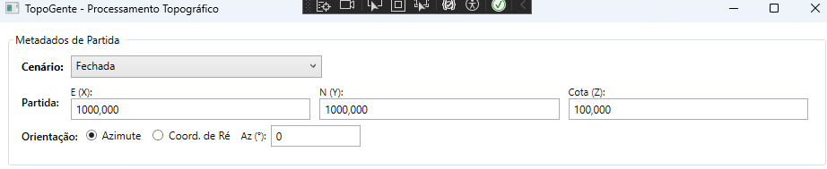
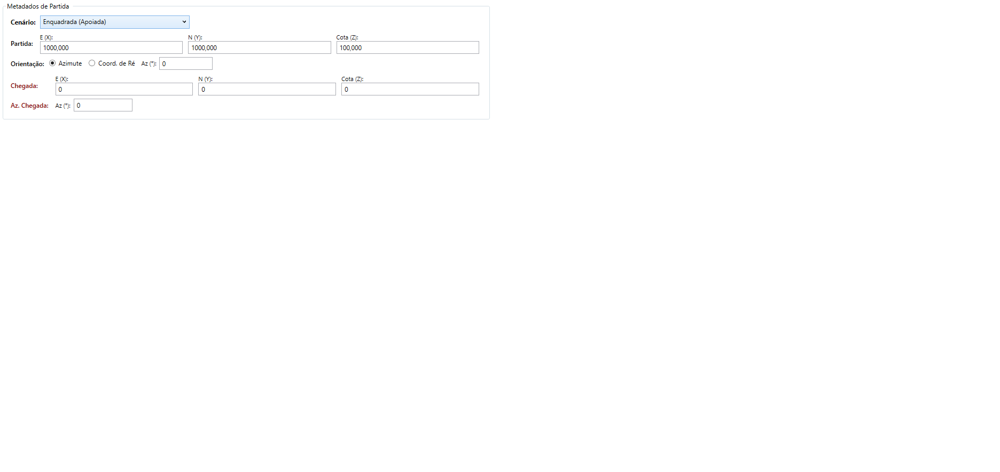
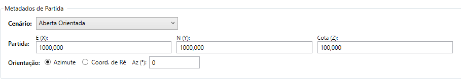
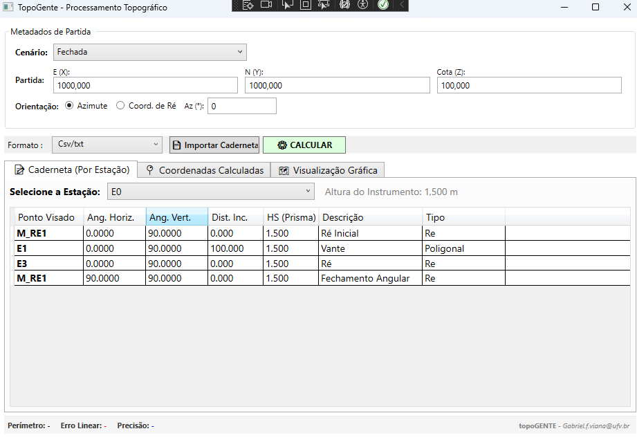
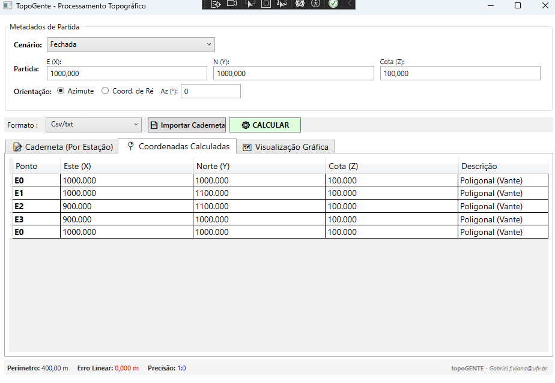
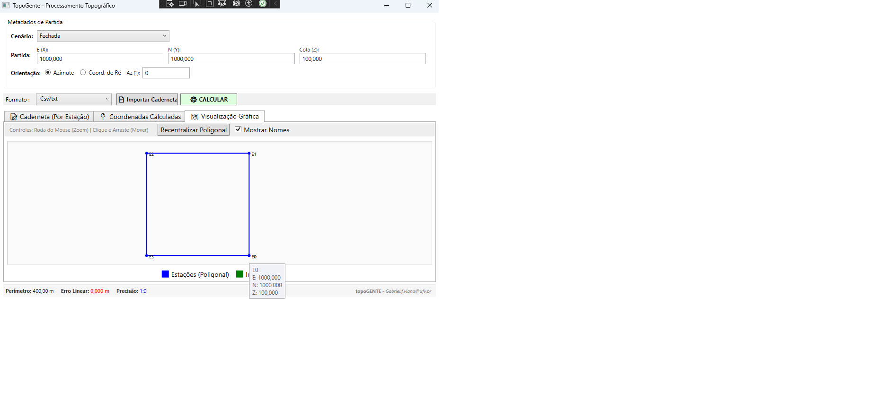

<h1 align="center">TopoGente - Processamento Topográfico 🌍</h1>

<p align="center">
  <https://img.shields.io/badge/C%23-239120?style=for-the-badge&logo=c-sharp&logoColor=white" alt="C#">
  
  
  
</p>

> O **TopoGente** é uma ferramenta de desktop desenvolvida para a automação matemática, cálculo analítico de levantamentos topográficos e visualização gráfica de coordenadas. O software foi arquitetado com base nos fundamentos da topografia clássica e nas diretrizes normativas (NBR 13.133).

---

## ✨ Funcionalidades

O sistema foi desenvolvido para lidar com as realidades de campo, operando com diferentes tipos de fechamento de malhas e ajustamentos espaciais:

*   **🔀 Processamento Multi-Cenários:**
    *   **Poligonal Fechada (Loop):** Cálculos de erro de fechamento e rateio proporcional de projeções.
    *   **Poligonal Enquadrada (Apoiada):** Transporte de coordenadas entre marcos conhecidos de alta precisão (Sistema Geodésico Brasileiro).
    *   **Poligonal Aberta Orientada:** Propagação de caminhamentos "cegos", com bloqueio automático de ajustamentos e alertas de responsabilidade técnica ("Efeito Alavanca").
*   **📊 Compensação Rigorosa:** Ajuste de fechamento linear utilizando o **Método de Bowditch** e nivelamento trigonométrico com redução ao horizonte ($DH = DI \cdot \sin(Z)$).
*   **📍 Cálculo de Irradiações:** Processamento passivo de pontos de detalhe vinculados ao esqueleto da poligonal, sem contaminação do perímetro de ajustamento.
*   **📂 Importação de Caderneta:** Parsing robusto de arquivos `.csv` e `.txt` gerados por Estações Totais, identificando automaticamente leituras de Ré, Vante e Irradiações.
*   **📈 Análise de Erros e QA:** Painel com auditoria de Tolerância Angular, Erro Linear (X, Y), Precisão Relativa (ex: 1:12.000) e Erro Altimétrico (Z).
*   **🗺️ Visualização Gráfica Integrada:** Plotagem cartográfica da geometria do levantamento em tempo real (Plano Topográfico Local).

---

## ⚙️ O Motor Matemático (Under the Hood)

A classe principal do software (`CalculoTopograficoService`) passou por estresse contínuo de testes geométricos, provando possuir **estabilidade algébrica estrutural**:
- Resistência a nulidades trigonométricas (imunidade à divisão por zero em coordenadas de Ré).
- Supressão matemática absoluta de métodos compensatórios em poligonais abertas.
- Capacidade de inicialização geodésica a partir do cálculo de azimute por coordenadas (Arco-Tangente).

---

## 📸 Demonstração e Fluxo de Trabalho

### 1. Configuração de Metadados (Cenário de Partida)
O sistema permite configurar as âncoras do projeto de acordo com a exigência normativa do levantamento:
*   *Partida por Azimute Direto ou por Coordenadas de Ré.*
*   *Definição do modelo de poligonal.*

Exemplos de Cenários de Poligonal

| Poligonal Fechada | Poligonal Enquadrada | Poligonal Aberta |
|---|---|---|
|  |  |  |

### 2. Entrada de Dados (A Caderneta)
Importação da caderneta de campo bruta, processando automaticamente os Ângulos Horizontais, Verticais (Zênite) e Distâncias Inclinadas (DI).



### 3. Resultados, Ajustamentos e QA
Ao processar, o software converte dados polares em cartesianos, aplicando as tolerâncias. Emissão de logs e alertas obrigatórios na interface.



### 4. Visualização Gráfica em Tempo Real
Representação visual clara da geometria do esqueleto da poligonal e das nuvens de pontos irradiados, com ferramentas nativas de Pan e Zoom.



---

## 🚀 Como Executar o Projeto

1. Clone o repositório:
   ```bash
   git clone https://github.com/SeuUsuario/TopoGente.git
Abra a solução .sln no Visual Studio 2022 (ou superior).
Certifique-se de ter o SDK do .NET Core ou .NET 6.0/7.0 instalado.
Defina o projeto TopoGente.UI como projeto de inicialização.
Compile e execute (F5).
Utilize os arquivos de teste na pasta /Data para simular uma importação de caderneta.

--------------------------------------------------------------------------------
🛠️ Tecnologias Utilizadas
Linguagem: C#
Framework: .NET Core / WPF (Windows Presentation Foundation) para interface rica e escalável.
Arquitetura: Separação entre lógica matemática de Geometria Analítica (TopoGente.Core) e interface de usuário (TopoGente.UI).

--------------------------------------------------------------------------------
👤 Sobre o Autor
Gabriel Viana Estagiário de Desenvolvimento no GENTE (Grupo de Engenharia e Tecnologias Espaciais) - UFV
📩 Contato: gabriel.f.viana@ufv.br 🏢 Instituição: Universidade Federal de Viçosa (UFV)

--------------------------------------------------------------------------------
Este software foi desenvolvido com base nas anotações e metodologias da disciplina de Topografia Básica (EAM 301) e do livro Fundamentos de Topografia (Autores: Luis Augusto Koenig Veiga, Maria Aparecida Zehnpfennig Zanetti e Pedro Luis Faggion.
Instituição: Universidade Federal do Paraná (UFPR), Curso de Engenharia Cartográfica e de Agrimensura.).
